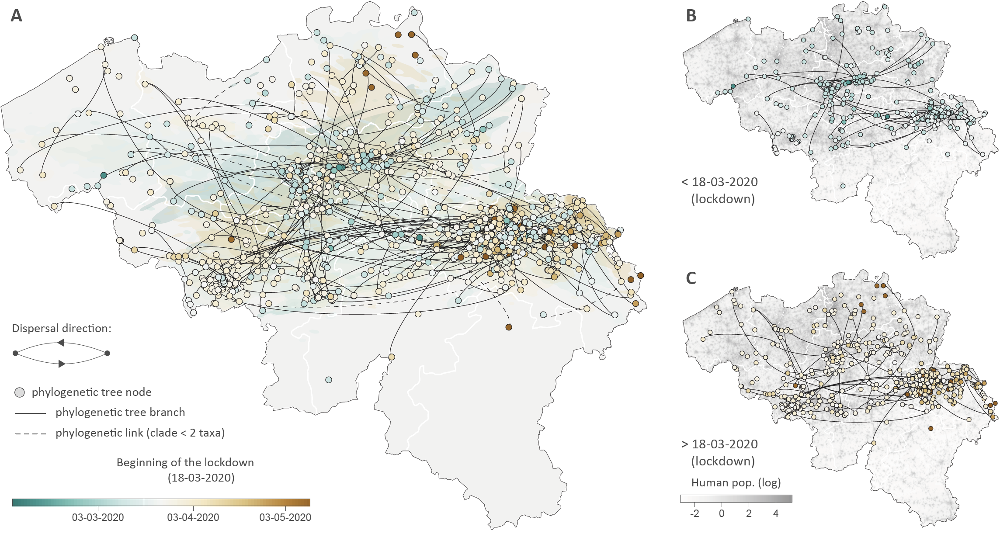

This repo gathers the input files and scripts related to our study entitled "**A Phylodynamic workflow to rapidly gain insights into the dispersal history and dynamics of SARS-CoV-2 lineages**" ([Dellicour *et al*. 2021](https://academic.oup.com/mbe/article/38/4/1608/5952687), *Molecular Biology & Evolution*). R scripts related to the analyses are all gathered within the file `Phylogenetic_analyses.r`.

Abstract: Since the start of the COVID-19 pandemic, an unprecedented number of genomic sequences of SARS-CoV-2 have been generated and shared with the scientific community. The unparalleled volume of available genetic data presents a unique opportunity to gain real-time insights into the virus transmission during the pandemic, but also a daunting computational hurdle if analyzed with gold-standard phylogeographic approaches. To tackle this practical limitation, we here describe and apply a rapid analytical pipeline to analyze the spatiotemporal dispersal history and dynamics of SARS-CoV-2 lineages. As a proof of concept, we focus on the Belgian epidemic, which has had one of the highest spatial densities of available SARS-CoV-2 genomes. Our pipeline has the potential to be quickly applied to other countries or regions, with key benefits in complementing epidemiological analyses in assessing the impact of intervention measures or their progressive easement.

**Figure: spatially explicit phylogeographic reconstruction of the dispersal history of SARS-CoV-2 lineages in Belgium.** (**A**) Continuous phylogeographic reconstruction performed along each Belgian clade (cluster) identified by the initial discrete phylogeographic analysis. For each clade, we mapped the maximum clade credibility (MCC) tree and overall 80% highest posterior density (HPD) regions reflecting the uncertainty related to the phylogeographic inference. MCC trees and 80% HPD regions are based on 1,000 trees subsampled from each post burn-in posterior distribution. MCC tree nodes were colored according to their time of occurrence, and 80% HPD regions were computed for successive time layers and then superimposed using the same color scale reflecting time. Continuous phylogeographic reconstructions were only performed along Belgian clades linking at least three sampled sequences for which the geographic origin was known (see the detailed analytical pipeline in Supplementary Information for further detail). Besides the phylogenetic branches of MCC trees obtained by continuous phylogeographic inference, we also mapped sampled sequences belonging to clades linking less than three geo-referenced sequences. Furthermore, when a clade only gathers two geo-referenced sequences, we highlighted the phylogenetic link between these two sequences with a dashed curve connecting them. Subnational province borders are represented by white lines. (**B**) MCC tree branches occurring before March 18, 2020 (beginning of the lockdown). (**C**) MCC tree branches occurring after March 18, 2020. See also supplementary figure S2, Supplementary Material online, for a zoomed version of the dispersal history of viral lineages in the Province of Liège, for which we have a particularly dense sampling.
